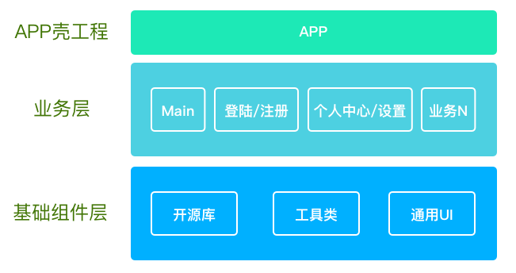
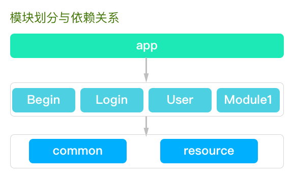
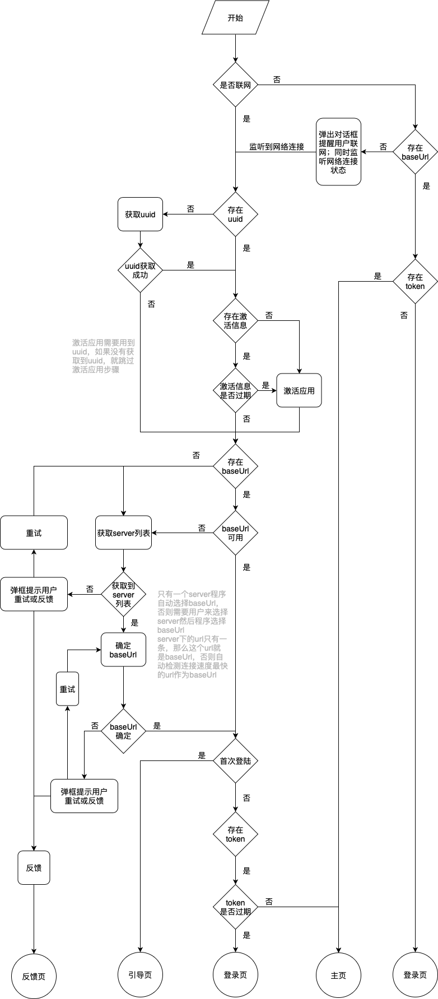
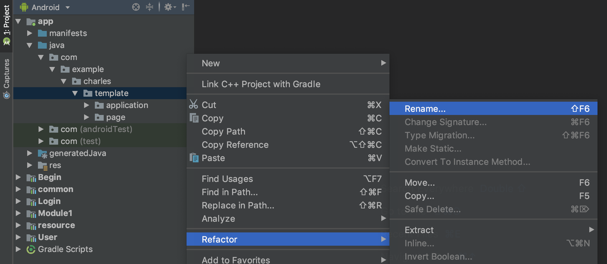

# TemplateAndroid

目录：

    概述
    模块功能及使用说明
    代码规范
    命名规范
    使用

## 概述

这是一个 Android 模版工程，根据本人三年来开发经验制作，规定了项目基础模块划分、文件夹结构、代码规范、变量命名规范等。目的是规范开发流程，省去项目初始化步骤，方便新人上手，方便合作开发。

## 项目结构

### 层次划分

目前工程结构比较简单，工程结构分为 3 层：App 壳工程、业务层、基础组件层，如下图所示。



#### App 壳工程

App 壳工程作为程序的唯一入口，仅执行项目初始化的一些操作，负责管理各个业务组件，不参与任何业务实现。

#### 业务层

业务层包含了应用程序每个业务模块的具体实现，包括公共业务登陆/注册等。

#### 基础组件层

基础组件层包括程序中每个业务模块用到的开源库的集成、二次封装， 各种工具类，通用 UI 等，可以用在本公司各个项目中，其中的代码一般不用改动。

### 模块划分

该项目按照层次和功能进一步划分为若干个模块：基础组件模块 common、resource，App 壳工程模块 app， 以及基础业务模块 Begin、 Login、User，其余就是根据每个项目不同建立各自的业务模块（如 Module1）。各个模块及依赖关系如下图所示。



#### common

common 模块属于业务不相关模块，包含工程中所有需要引入的第三方库、第三方库的封装、各种 Util、各种基类、通用的自定义 View 等，不包含任何具体业务实现，可以用在不同的项目中，其中的代码一般不用动。

#### resource

resource 模块属于业务强相关模块，存放项目中用到的视频、图片、字符串、颜色值等资源。

#### Begin

Begin 模块属于业务不相关模块，是程序的入口，有一个初始化页面和引导页，在程序被唤起的时候进入初始化页同时进行程序的初始化。

#### Login

Login 模块属于业务不相关模块，不同的程序可以共用，在某些程序中可以没有该模块。包含三个页面：登陆页面、注册页面、找回密码页面，执行用户登录注册等基础业务。

#### User

User 模块即个人中心模块，属于业务弱相关模块，需要根据业务需求做调整。User 模块提供个人信息管理、用户反馈、检查更新、退出账号等基本功能。

#### Module1

Module1 模块是业务模块，根据业务需求进行编写，有必要的话可以建立多个不同模块。

## 模块功能及使用说明

### common 模块

common 模块文件结构如下所示：

```
-commom
|...
|-java
    |-com
        |-charles
            |-common
                |-base
                |-device
                |-erroe
                |-kv
                |-multiple
                |-network
                |-update
                |-videoview
                |-Constant.java
```

#### base 文件夹

base 文件夹中存放一些基类，其文件结构如下所示：

```
-base
    |-BaseActivity.java
    |-BaseApplicition.java
    |-BaseFragment.java
    |-BasePresenter.java
    |-BaseView.java
```

- BaseApplicition.java

  BaseApplicition.java 继承自 Application， 提供了全局的 Context， 执行某些初始化操作。

  每个 Android App 运行时，会首先自动创建 Application 类并实例化 Application 对象，且只有一个，它的生命周期贯穿 App 的始终。

- BaseActivity.java

  BaseActivity.java 继承自 AppCompatActivity，是程序中所有 Activity 的基类（也可根据情况不继承它），提供了每个 Activity 都可能用到的一些公用方法，如显示 Loading、Alert 弹框、监听与安装程序更新等。

- BaseFragment.java

  BaseFragment.java 继承自 Fragment， 是程序中所有 Fragment 的基类（也可根据情况不继承它），提供了每个 Fragment 都可能用到的一些公用方法。

- BasePresenter.java

  BasePresenter.java （其作用会在后面讲到）是程序中所有 Fragment 的基类（也可根据情况不继承它），提供了每个 Fragment 都可能用到的一些公用方法。

- BaseView

  BaseView 是一个接口（其作用会在后面讲到），是 presenter 和 Activity 之间通信的桥梁。程序中每个 xxView 都应该继承它。

#### device 文件夹

device 文件夹中有两个类，顾名思义是收集设备硬件信息，其文件结构如下所示：

```
device
    |-DeviceInfo.java
    |-GetDeviceInfo.java
```

- DeviceInfo.java

  DeviceInfo.java 是一个对象，规定了设备硬件信息的属性。属性含义详见类内注释。

  ```java
  public class DeviceInfo {
      private String deviceID;
      private String model;
      private String size;
      private String cpu;
      private String memory;

      ...
  }
  ```

- GetDeviceInfo.java

  GetDeviceInfo.java 是一个获取 DeviceInfo 各个属性的工具类。

#### error

error 文件夹下存放程序崩溃信息和网络连接错误信息。

```
-error
    |-ApiErrorInfo.java
    |-ExceptionInfo.java
```

- ApiErrorInfo.java

  ApiErrorInfo.java 规定了网络连接失败时需要收集哪些信息报告给中心服务器，方便开发人员定位崩溃原因，及时修复程序 bug。属性含义详见类内注释。

  ```java
  public class ApiErrorInfo {
      private String requestURL;
      private String requestHeader;
      private String requestMethod;
      private String requestParams;
      private String responseHTTPStatusCode;
      private String responseStatusCode;
      private String responseBody;
      private String responseAt;
  }
  ```

- ExceptionInfo.java

  ExceptionInfo.java 规定了程序崩溃时需要收集哪些信息报告给中心服务器，方便开发人员定位崩溃原因，及时修复程序 bug。属性含义详见类内注释。

  ```java
  public class ExceptionInfo {
      private String shortName;
      private String exceptionType;
      private String appVersion;
      private String deviceUUID;
      private String phoneNetwork;
      private String OSRelease;
      private String exceptionReason;
      private String exceptionTrace;
      private String threadName;
      private String threadTrace;
      private String exceptionAt;

      ...
  }
  ```

#### kv

kv 文件夹是对腾讯的 MMKV 库做的简单封装。MMKV 用来存储 key-value 数据对，类似于 SharedPreferences，比 SharedPreferences 性能更好。在我们项目中使用它来替代 SharedPreferences。

```
-kv
    |-Kv.java
```

#### network

network 文件夹存放网络操作相关类，是对 retrofit 的简单封装。

```
-network
    |-response
        |-BaseResponse.java
        ...
    |-AbstractMyCallBack.java
    |-ApiManager.java
    |-NetworkUtil.java
    |-SubmitError.java
```

- response/BaseResponse.java

  BaseResponse.java 规定了网络请求返回的基本格式（只在我们自己的网络请求中生效，是内部约定，基本不变）。

  ```java
  public class BaseResp<T> {
      private T data;
      private String statusCode;
      private String message;
  }
  ```

- AbstractMyCallBack.java

  对请求响应做初步处理，如果成功直接将响应数据传给调用方，如果失败则记录失败原因并将失败信息上传到中心服务器。

- ApiManager.java

  管理请求地址与参数。

- NetworkUtil.java

  网络操作工具类。

- SubmitError.java

  提交程序崩溃信息和网络连接错误信息的工具类。

#### update

update 文件夹存放检查程序版本更新和安装  更新的工具类。

```
-update
    |-AndroidOPermissionActivity.java
    |-CheckUpdate.java
    |-UpdateService.java
```

- AndroidOPermissionActivity.java

  AndroidOPermissionActivity.java 是在 Android 8.0 以上的版本中，用来提示用户向程序授予安装新版本 apk 权限的页面。

- CheckUpdate.java

  CheckUpdate.java 是用来检查版本更新的工具类。

- UpdateService.java

  UpdateService.java 是用来在后台下载和更新程序的服务。

#### util

util 文件夹存放一些基础工具类。

```
-util
    |-AlertUtil.java
    |-AnimUtil.java
    |-AppUtil.java
    |-DateUtil.java
    |-DisplayUtil.java
    |-FileUtil.java
    |-ImageUtil.java
    |-LogUtil.java
    |-StringUtil.java
    |-TimeCount.java
    |-ToastUtil.java
    |-TokenUtil.java
```

- AlertUtil.java

  AlertUtil.java 对 AlertDialog 的简单封装，用一行代码唤起一个 AlertDialog。

- AnimUtil.java

  执行动画的工具类。

- AppUtil.java

  获取程序基本信息。

- DateUtil.java

  操作日期。

- DisplayUtil.java

  px、dp、sp 之间相互转换。

- FileUtil.java

  文件操作。

- ImageUtil.java

  图片操作。

- LogUtil.java

  对 Log 的简单封装。在程序上线时要将其 showLog 属性设为 false，不打印 log。

- StringUtil.java

  字符串操作。

- TimeCount.java

   倒计时。

- ToastUtil.java

  对开源库 com.hjq:toast 的简单封装，代替系统 Toast，解决了有些机型关闭通知权限无法弹出 Toast 的问题。

- TokenUtil.java

  封装了 token 的存、取、刷新。

#### view

view 文件夹存放通用的自定义 View。

```
-view
    MultipleStateView.java
```

- MultipleStateView.java

  通用的多状态占位页面，包括加载页面、空数据页面、网络连接错误页面、无网络页面。

#### Constant.java

Constant.java 保存项目中使用的常量。

### resource 模块

resource 模块文件结构如下所示：

```
-resource
|...
|-res
    |-drawable
    |-mipmap
    |-values
        |-colors.xml
        |-dimens.xml
        |-strings.xml
```

该模块没有任何功能代码， 只有 drawable、mipmap、values 3 个文件夹，其中 drawable 文件夹存放.xml 格式图标；mipmap 文件夹存放图片，values 文件夹存放颜色值、尺寸值、字符串等。程序中  用到的公共资源都应该放在 resource 模块中。

这样做是为了防止资源重复，比如模块 A 和模块 B 都有一个图标 ic_user.xml，这时会占用程序体积，并且编译时程序会报错。

### begin 模块

begin 模块是程序启动的入口，包含启动页和引导页。

```
-Begin
    |...
    |-java
        |-com
            |-charles
```

其中启动页（SplashActivity）是程序启动后第一个唤起的页面，在该页面中进行了程序初始化的一些操作，程序初始化流程较为复杂，参考下图：



整个流程已经实现，使用者只需在 SplashActivity.java 中实现 SplashView 接口方法进行页面跳转即可，SplashView 接口方法含义见注释。

## 代码规范

项目代码规范统一使用[阿里巴巴 Java 开发手册](https://github.com/alibaba/p3c)。

在 Android Studio 中安装 **Alibaba Java Coding Guidelines** 插件对代码自动进行格式检查。

##  命名规范

讲解命名规范前，先初略介绍下当前主要的标识符命名法和英文缩写规则。

**标识符命名法**主要有 4 种：

1. 驼峰(Camel)命名法:又称小驼峰命名法，除首单词外，其余所有单词的第一个字母大写。

2. 帕斯卡(pascal)命名法:又称大驼峰命名法，所有单词的第一个字母大写。

3. 下划线命名法:单词与单词间用下划线做间隔。

4. 匈牙利命名法:开头字母用变量类型的缩写，其余部分用变量的英文或英文的缩写，要求单词第一个字母大写。

标识符命名原则:**尽可能的用最少的字符而又能完整的表达标识符的含义**。

下面为常见的**英文单词缩写**:

| 名称        | 缩写                        |
| ----------- | --------------------------- |
| icon        | ic（主要用在 app 的小图标） |
| average     | ave                         |
| background  | bg                          |
| document    | doc                         |
| error       | err                         |
| information | info                        |
| initial     | init                        |
| image       | img                         |
| length      | len                         |
| library     | lib                         |
| message     | msg                         |
| passwrod    | pwd                         |
| position    | pos                         |
| string      | str                         |

程序中使用单词缩写原则：**不要用缩写，除非该缩写是约定俗成的**。

上面只是一些建议，在开发中可以使用缩写也可以不使用。

### 命名规范

1.  包（packages）: 采用反域名命名规则，全部使用小写字母。一级包名为 com，二级包名为 xx（可以是公司或则个人的随便），三级包名根据应用进行命名，四级及以上包名为模块名或层级名。

2.  类（classes）：名词，采用大驼峰命名法，尽量避免缩写，除非该缩写是众所周知的， 比如 HTML,URL，如果类名称中包含单词缩写，则单词缩写的每个字母均应大写。

    举例

    | 类                  | 描述                    | 例如                            |
    | ------------------- | ----------------------- | ------------------------------- |
    | activity 类         | Activity 为后缀标识     | 欢迎页面类 WelcomeActivity      |
    | adapter 类          | Adapter 为后缀标识      | 新闻详情适配器 NewDetailAdapter |
    | Service 类          | 以 Service 为后缀标识   | 时间服务 TimeService            |
    | BroadcastReceive 类 | 以 Broadcast 为后缀标识 | 时间通知 TimeBroadcast          |
    | 工具类              | Util 为后缀标识         | 字符串工具类 StringUtil         |
    | 基础类              | 以 Base 开头            | BaseActivity,BaseFragment       |

3.  接口（interface）：命名规则与类一样采用大驼峰命名法。

4.  方法（methods）：动词或动名词，采用小驼峰命名法。

    | 类                   | 描述                                                         |
    | -------------------- | ------------------------------------------------------------ |
    | initXXX()            | 初始化相关方法,使用 init 为前缀标识，如初始化布局 initView() |
    | isXX(),checkXX()     | 返回值为 boolean 型的请使用 is 或 check 为前缀标识           |
    | getXX()              | 返回某个值的方法，使用 get 为前缀标识                        |
    | saveXX()             | 与保存数据相关的，使用 save 前缀标识                         |
    | clearXX(),removeXX() | 清除数据相关                                                 |

5.  变量（variables）采用小驼峰命名法。类中控件名称必须与 xml 布局 id 保持一致。

    用统一的量词通过在结尾处放置一个量词，就可创建更加统一的变量，它们更容易理解，也更容易搜索。例如，请使用 strCustomerFirst 和 strCustomerLast，而不要使用 strFirstCustomer 和 strLastCustomer。

    量词列表：量词后缀说明

    First   一组变量中的第一个

    Last    一组变量中的最后一个

    Next    一组变量中的下一个变量

    Prev    一组变量中的上一个

    Cur     一组变量中的当前变量

6.  常量（Constants）全部大写,采用下划线命名法.例如：MIN_WIDTH。

7.  图片资源（drawable、mipmap 文件夹下）：全部小写，采用下划线命名法，加前缀 ic 或 img 区分。

8.  布局文件（layout 布局文件）全部小写，采用下划线命名法。

    (1) Activity 布局：activity_XX.xml

    (2) Dialog 命名：dialog_XX.xml

    (3) 列表项命名： item_XX.xml

    (4) 包含项：include_XX.xml

    (5) 自定义 view：view_XX.xml

9.  动画文件（anim 文件夹下）：全部小写，采用下划线命名法，加前缀区分。

    | 动画命名例子     | 描述       |
    | ---------------- | ---------- |
    | fade_in          | 淡入       |
    | fade_out         | 淡出       |
    | push_down_in     | 从下方推入 |
    | push_down_out    | 从下方推出 |
    | slide_in         | 滑动进入   |
    | shrink_to_middle | 向中间缩小 |

10. 资源 ID（resourcesid）：大小写规范与方法名一致，采用小驼峰命名法。命名规范为“资源控件的缩写 名”+“变量名”。注意：页面控件名称应该和控件 id 名保持一致。

    strings.xml，colors.xml 等中的 id 命名模式：activity 名称*功能模块名称*逻辑名称/activity 名称*逻辑名称/common*逻辑名称

    strings.xml 中，使用 activity 名称注释，将文件内容区分开来

11. layout 中的 id 命名模式为：view 缩写\_模块名称\_view 的逻辑名称。

    常用 view 的缩写详情如下：

    | view         | 缩写  |
    | ------------ | ----- |
    | LayoutView   | lv    |
    | RelativeView | rv    |
    | TextView     | tv    |
    | ImageView    | iv    |
    | CheckBox     | cb    |
    | RadioButton  | rb    |
    | EditText     | edt   |
    | WebView      | webVi |
    | RecyclerView | rv    |

## 使用

1. 克隆到本地。

2. 修改 app 包名与 build.gradle(app)中的 applicationId。

   修改包名方式如下：
   

3. 注释掉 build.gradle(app)中对 Module1 的依赖。

4. 替换 app/res/mipmap/ic_launcher.png 作为新 app 的图标。

5. 替换 app/res/values/strings.xml 中 app_name 作为新 app 的名称。

6. 根据需要编写自己的业务模块。
